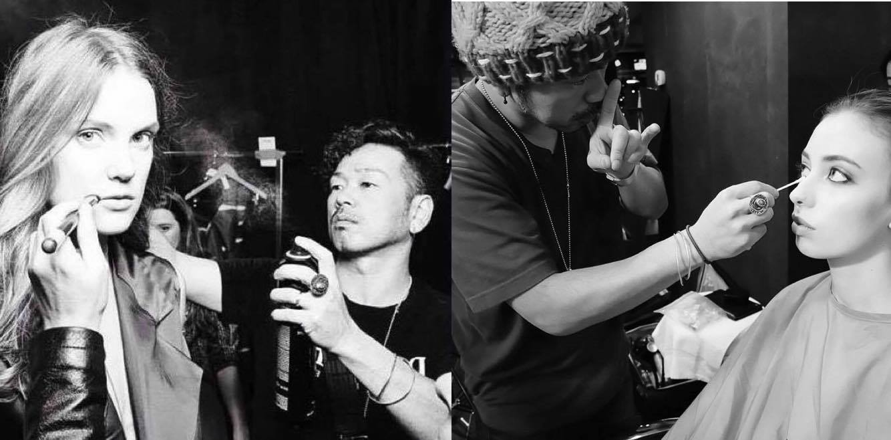

# July Events

## Japan Festival Mississauga

Come to our booth at [Japan Festival Mississauga](http://www.japanfestivalmississauga.com) on Sunday July 10, 12:00 PM to 8:00 PM. We will have:

- quick tuina/shiatsu services
- make-up and hair services

... and delicious Bizen Sangria with Chinese medicinal fruits!

## Bring out the charm 〜大人のスタイルアップ講座〜

Two sessions: Saturday July 16, 4:30 PM to 6:00 PM, and 7:00 PM to 8:30 PM.

Special guest: Beauty Director (Hair / Make-up / photo) Taca Ozawa

[Details on Facebook](https://www.facebook.com/events/1629849077342116/)

# SECTION

## SECTION

# SECTION

## Regular Events

Join us for an exciting array of events and classes. Upcoming subjects include:

  * Aroma workshop
  * Building Blocks Dietary Education Class
  * Skin care and make up seminar
  * Healthy Living Workshop
  * Eco living seminar
  * Chinese medicine (yakuzen) workshop
  * Microbiotic workshop
  * Super Food Seminar

# SECTION

[See more on our Facebook page!](https://www.facebook.com/nagomibeautyroom/events)

