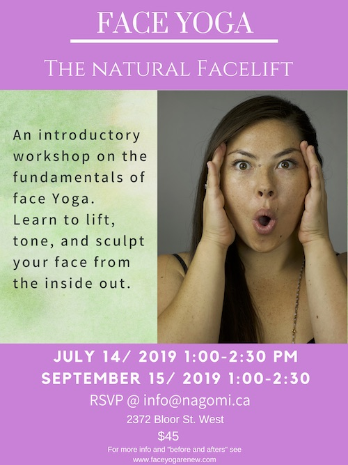

# Upcoming Events

Facial Yoga is a trending practice that is said to maintain your beauty naturally!!!! It's a combination of resistance and relaxation exercises that tighten, tone and  lift your face from the inside out, giving you a natural facelift. 

Sep 15th (SUN) 1:00-2:30 p.m @ nagomi beauty room (2372A Bloor St west) FEE:  $45  

In this class, Sophia, a life style coach and Certified Face Yoga Method instructor will present:

* What is the face yoga method?
* Talk about the different muscles in the face that can be targeted to lift the skin, naturally get rid of wrinkles and brighten the complexion.
* Discuss the specific concerns that each one of us might have
* Practice a few poses!

We believe this class can help you looking great and feeling great!! 

Spots are limited.  E-mail or call us info@nagomi.ca / 647-993-1130 to secure your seat!

# More Events

Join us for an exciting array of events and classes. Upcoming subjects include:

  * Aroma workshop
  * Building Blocks Dietary Education Class
  * Skin care and make up seminar
  * Healthy Living Workshop
  * Eco living seminar
  * Chinese medicine (yakuzen) workshop
  * Microbiotic workshop
  * Super Food Seminar

[See more on our Facebook page!](https://www.facebook.com/nagomibeautyroom/events)

