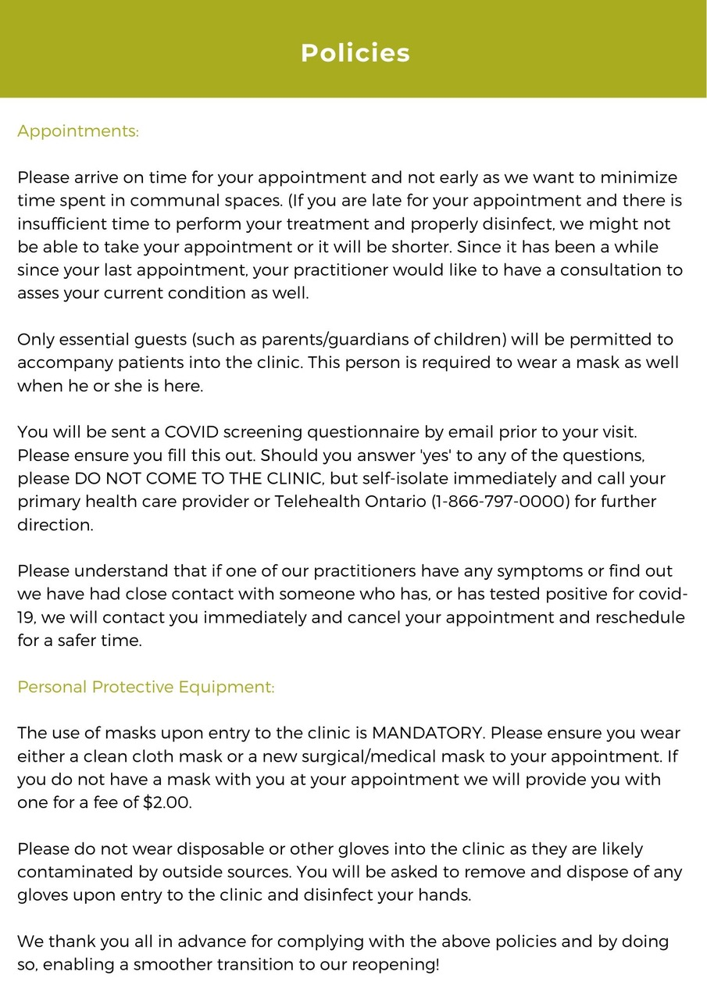

All the treatment room surfaces (massage table, oil bottle, stool, counter) and contact surfaces in the space like door handles and light switches (entrance / treatment room / bathroom) are sanitized after each client.  Decor is simplified for sanitation purposed. Linens are freshly laundered, and are changed between every client.

We wash our hands before as well as after every treatment, wear a mask during the treatment and continue to self-screening everyday to make your environment as safe as possible.
