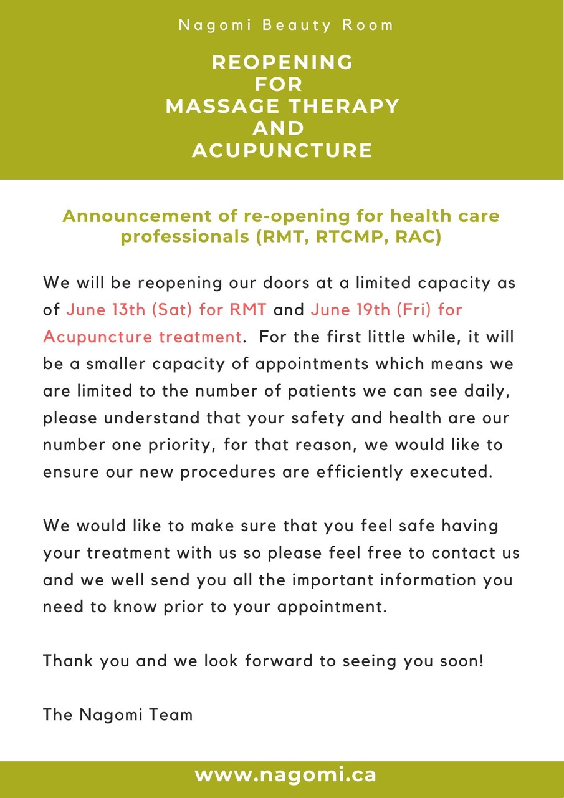
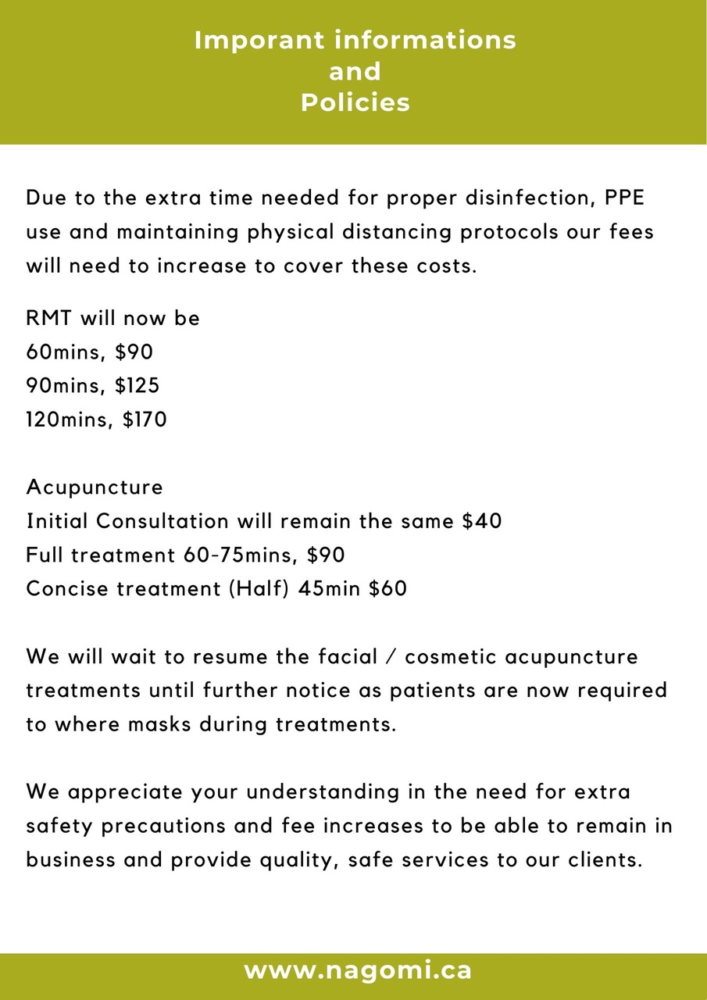
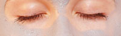
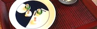

### We are open by appointment only to ensure a personalized experience

Please note that we cannot answer calls during customer appointments so the best way to book with us is to send us an email or text us and we will reply soon as we can.

### We accept debit and credit cards

Pay with the convenience of debit and credit card.

### Gift certificates available

Please consider purchasing our gift certificates for your future use, or for a deserving person who is working hard through this difficult time. 

Thank you very much for your support.

[Contact us](mailto:info@nagomi.ca) for more details.

## Services

* [Facial Treatment](services#facial)
* [RMT](services#rmt)
* [Acupuncture & Herbal Medicine & Cupping](services#acupuncture--herbal-medicine)
* [Eyelashes](services#eyelashes)
* [Eyelash Lift and Tint](services#eyelash-lift-and-tint) [NEW!!!]
* [Waxing](services#waxing)

### [ Visit our Facebook page](http://www.facebook.com/nagomibeautyroom)

Join the conversation at Nagomi's Facebook page. There, you'll find information about upcoming events, photos from sessions and classes, and all of the latest news. Have a look! [Nagomi Beauty Room](http://www.facebook.com/nagomibeautyroom)

### Healthy Moms

We are proud to be a participating business in this great resource for moms! <https://gohealthymoms.com>

## Services

Our reasonable prices are inspired by you, hard working women who put themselves last and deserve to treat themselves.

[Find out more](services)

## Our Team

Our expert team is dedicated to providing you with personalized service, to benefit both your body and your mind.

[Find out more](team)

## Product

Our products are derived from organic Aloe Vera and contain no preservatives, fragrances, alcohol, or artificial colours. They are allergy tested and suitable for all skin types.

[Find out more](what-we-use)

## New Policies and Procedures as we Reopen

We are following all the recommendations from the professional regulatory and Ontario Public Health, and have made changes in order to safely provide our services.

[Find out more](events)

