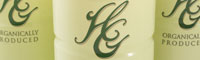

## **July Promotions**

### Deluxe Facial Treatment 20% OFF!!!!

Summer is finally here, and with that glorious sunshine comes some not-so-sunny skin issues. Sun-burnt? Dry? Oily?

Deluxe Facial. This particular treatment uses a special essence with concentrated Aloe powder which includes three types of hyaluronic acid, vitamin C derivatives, coenzyme Q10 and ceramide, known to enhance and repair skin.

This treatment/essence blocks UV, dryness, and other environmental factors and lets your skin radiate beauty from the inside out!!

### Thai massage therapy 60 mins $65!!! 90mins $90!! With RMT

This type of massage has been around for more than two thousand years to promote physical and mental relaxation through the use of practitioner assisted Yoga positions.

The benefits of Thai massage therapy are:

- Pain Relief
- Increased Flexibility
- Relaxation
- Improved Circulation
- Overall Well-Being

### RMT massage treatment available!!

We offer a unique blend of Massage and Manual Therapy including Swedish, Shiatsu and Thai massage.

## Services

* [Facial Treatment](services#facial)
* [Body Treatment](services#body)
* [RMT](services#rmt)
* [Acupuncture & Herbal Medicine](services#acupuncture-herbal-medicine)
* [Prenatal Massage](services#body)
* [Eyelashes](services#eyelashes)
* [Waxing](services#waxing)
* [Nail](services#nail)

### [ Visit our Facebook page](http://www.facebook.com/nagomibeautyroom)

Join the conversation at Nagomi's Facebook page. There, you'll find information about upcoming events, photos from sessions and classes, and all of the latest news. Have a look! [Nagomi Beauty Room](http://www.facebook.com/nagomibeautyroom)

### Quick Acu Thursday (11am – 4pm)

**$40 (45 ~ 60 min)**

This service is for those who are interested in acupuncture treatment but never done before, those who don't have insurance or those who want to get quick but concise treatment, THIS IS THE DAY!
Please contact us if you have any questions or want to book with us!

### Gift certificates now available

Show how much you care with the gift of relaxation. [Contact us to learn more!](mailto:info@nagomi.ca)

### We accept debit and credit cards

Pay with the convenience of debit and credit card.

## Services

Our reasonable prices are inspired by you, hard working women who put themselves last and deserve to treat themselves.

[Find out more](services)

## Events

From cooking classes to makeup tutorials, find out what exciting new events are coming up at Nagomi.

[Find out more](events)

## About

Our products are derived from organic Aloe Vera and contain no preservatives, fragrances, alcohol, or artificial colours. They are allergy tested and suitable for all skin types.

[Find out more](what-we-use)

## Take Aloe Home

Enjoy the benefits of Aloe Vera treatments in the comfort of your home with these products.

Coming Soon!

