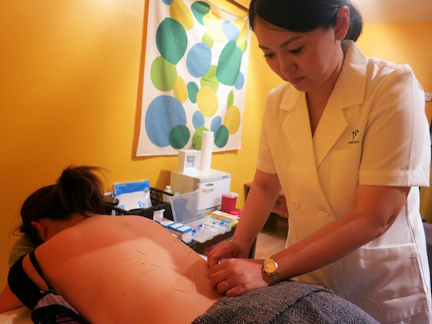
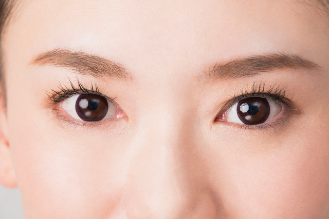

# Book your facial with us today!

Our reasonable prices are inspired by you, hard working women who put themselves last and deserve to treat themselves. We have early morning and evening appointments available to make things easier.

[Email us to book your appointment today!](mailto:info@nagomi.ca)

# Facial

## Simplicity Facial

40min, $40

A treatment for people on the go that doesn’t skimp on luxury. This facial covers all the essentials in one concise appointment and includes a customized skincare consultation, facial massage, cleansing, exfoliation, masque and moisturizing treatment.

## Signature Facial

75min, $60

Lose yourself in our signature treatment, a restorative Aloe Vera masque designed for enhanced exfoliation and luxurious moisturizing. This treatment includes an in-depth skincare consultation, extended facial massage and deep pore cleansing.

## Deluxe Facial

90min, $85

Enjoy all the benefits of our standard facial with a little more extravagance. Combine our restorative masque treatment and cleansing with the added bonus of deep scalp, shoulder and décolletage massage.

## Facial and Body Packages

**Simplicity Facial + Body, 90min, $95**

**Signature Facial + Body, 120min, $110**

## The Facial Massage

This special massage stimulates the lymph glands in the face, removing toxins and excess fluids.
Removing these toxins gives you healthy, glowing skin.  This massage also helps to replenish moisture and remove the top layer of dead skin cells, which will help to even out skin tone.

Another benefit of this facial massage is it stimulates collagen production which fills in wrinkles and smooths out the face.

Also, bad circulation makes your face seem puffy and pale.  Massaging around your mouth, eyes and eyebrows will increase the circulation and take away puffiness to brighten your skin.

Lastly, this facial massage will help you relax, de-stress and eliminate headaches by focusing on pressure points.

Overall, it reduces wrinkles, lifts the face, prevents and improves sagging skin, reduces pore size and will get rid of puffy eyes and under-eye bags.

## Head Massage & Eyecare

20 minutes, $25

# RMT

We offer a unique blend of Massage and Manual Therapy including Swedish, Shiatsu and Thai massage.

- 60min, $85
- 90min, $120
- 120min, $160

- Prenatal Massage 45min $90

# Acupuncture & Herbal Medicine

## Acupuncture

* Initial Consultation and Diagnosis $40 / 30mins
* Acupuncture Treatment $80 / 60mins-75mins
* Quick Acupuncture $50 +consultation $10

  This service is for those who are interested in acupuncture treatment but never done before, those who don’t have insurance or those who want to get quick but concise treatment, THIS IS THE DAY! Please contact us if you have any questions or want to book with us!
* Prenatal / Postnatal Acupuncture & Moxibustion $90 / 75mins
* Fertility treatment acupuncture $90 / 75mins 
* Paediatric Acupuncture  $50

## Cosmetic Acupuncture

* Trial Session $77 / 40mins (NEW!!!) For someone want to try to see how it works!
* Consultation $40
* Facial Acupuncture $100 / 60mins
* Beauty Acupuncture (Face + Body) $150 / 90 mins  (NEW!!!!!)
* Luxury Package (NEW!!!!!) (Face + body + head acupuncture + facial treatment) $250  / 120mins 

This cosmetic treatment is said to help make skin look younger, smoother, and all-around healthier NATURALLY.

On the face, the acupuncturist inserts tiny and painless needles (Thin as a hair). As these needles puncture the skin, they create wounds within its threshold, which are called positive microtraumas. 

When your body senses these wounds, it goes into repair mode.
These punctures stimulate your lymphatic and circulatory system, which work together to deliver nutrients and oxygen to your skin cells, nourishing skin from the inside out. 

This helps even out your complexion and promote your skin’s glow. The positive microtraumas also stimulate the production of collagen. This helps improve elasticity, minimizing fine lines and wrinkles.

The effects of Facial Acupuncture are cumulative and last up to 3-5 years after a course of 10 treatments, with maintenance.  We do have a great package plan for 6, 10, and 15 treatments.

Please call or [email](mailto:info@nagomi.ca) for an appointment or if have any questions or concerns! 

## Herbal Medicine

* Initial Consultation and Diagnosis $80  / 45mins-60mins
* Follow up consultation $20 / 30mins 
* Herbal Medicine Cost $20-$40 / 2weeks (varies by ingredients)

Herbal Medicine will be prescribed by our experienced RTCMP (Registered Traditional Chinese Medicine Practitioners)

## Tuina Massage & Cupping

* 30 minutes $40
* 60 minutes $75
* Cupping, 30 minutes, $30

# Eyelashes

## Eyelash Extensions

* Natural (60~80 Lashes) $65
* Glamorous (80~100 Lashes) $85
* Diva (over 100 Lashes) $120

## Touch up

* Before 2 weeks $35
* Before 3 weeks $55
* Before 4 weeks $65
* After 4 weeks $85
* Only removal $30

## Eyelash Lift and Tint

Lash lifting and tinging is one of the newest trends in the beauty industry.  

It is a semi permanent treatment which curls and tints your natural eyelashes.

With lifted lashes, they look longer and fuller. Tinting will enhance the defining effect!!

* Eyelash Lift $70
* Eyelash Tint $10

# Waxing

## Body

* Full leg $40
* Half leg $25
* Under arms $15
* Full arms $30
* Half arms $20
* Bikini $20+
* Back $20+

## Face

* Eyebrow $13
* Upper lip or Chin $9

## Specials

* Bridal package     $100

## Specials and Packages

* Birthday Party
* Holiday Gift
* Mother's Day
* Valentine's Day
* Bridal
* Girls' Party
* Bachelorette Party
* Anniversary

# We are open by appointment only to ensure a personalized experience.

Please note that we cannot answer calls during customer appointments so the best way to book with us is to send us an [email](mailto:info@nagomi.ca) or [text](tel:1-647-993-1130) us and we will reply  soon as we can.
