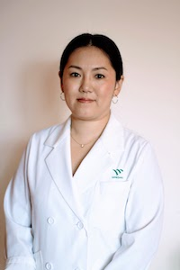
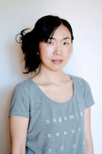
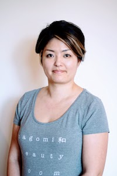

# Our Team

## Yuki Minesaki (R.a.c / RTCMP)

Yuki is a registered traditional Chinese Medicine practitioner and acupuncturist under the College of Traditional Chinese Medicine Practitioners and Acupuncturists of Ontario (CTCMPAO). Yuki’s professional focus is on women’s health including prenatal/postnatal care, fertility, menstrual issues, pediatric care, general pain, insomnia, stress, depression, anxiety, digestive issues.  
Yuki has special training in pregnancy massage in Japan and is well acquainted with the particulars of acupuncture for pregnant women.

Yuki was born and raised in Japan and grew up learning from her pharmacist parents who specialize in Chinese herbal medicine. She grew up learning about Chinese herbs and developed an understanding of the field as more than health care but a healthy lifestyle.
 
For all Yuki’s patients, she treats both the mind and body and uses a number of techniques to set her patients at ease and on the path to healing including acupuncture, moxibustion, Chinese herbal medicine, tuina massage, cupping as well as nutritional advice based on the TCM principals of a medicated diet. 
 

## Atsuko Kakutani (RMT)

Atsuko has studied and practiced Namikoshi Shiatsu since 2002, learned Swedish massage in 2014, and became a registered massage therapist in 2015.

Atsuko's health care profession began as a geriatric care worker in Tokyo, Japan. She realized that constant shiatsu/massage treatments were effective for physical and mental wellness and she so chose to pursue a path as a therapist. 

Atsuko can customize massage services to include Shiatsu, Swedish massage and Thai massage to adjust for each client's condition, their preferences and their treatment goals. 

She would love to discuss the treatment that works for you.

## Megumi Overton (Owner/Esthetician)

Founder Megumi Overton is a wife and mother of two who has been a skin care consultant for more than a decade. Inspired by her own experience battling skin problems, Megumi found that the best solutions for skin care lie within nature itself.

Megumi was born and raised in Japan. Growing up, her mother had a salon in their home where she created a casual and warm place for her clients. Nagomi is inspired by Megumi’s roots and carries on what her mother started. She would like to not only connect with her clients but also support the community.

Her team provides well rounded services that focuses on both her client’s bodies and their minds.  

Megumi wants to make her space one that promotes a relationship between beauty and health, and be a place where her clients can walk in stressed and leave happier and with a more positive outlook on life. 

