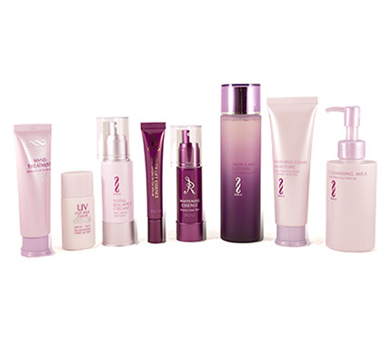

# SECTION

## About

Founder Megumi Overton is a wife and mother who has been a skin care consultant for more than a decade. Her speciality is the Aloe vera plant, renowed for its natural healing properties. Inspired by her own experience battling skin problems, Megumi found that the best solutions for skin care lie within nature itself. She believes that even a small change to a girl's beauty regimen can go a long way.

## What We Use

Our products are specially imported from Japan and Nagomi is proud to be the exclusive Canadian distributer. Our products are derived from organic Aloe vera and contain no preservatives, fragrances, alcohol, or artificial colours. These products are allergy tested and suitable for all skin types.

### Benefits of Aloe Vera

This miracle plant is one of the oldest known medicinal plants, with a legacy reaching as far back as Cleopatra. The gel that fills every leaf has been proven to accelerate healing and soothe enflamed or tired skin. Aloe actively helps skin to repair by naturally stimulating cell production and increasing collagen. The gel also contains elastin fiber which, working alongside collagen, firms the skin’s matrix, toning and smoothing its appearance. Aloe’s natural balance of essential minerals and vitamins enhance its moisturizing, cleansing, and soothing qualities.
